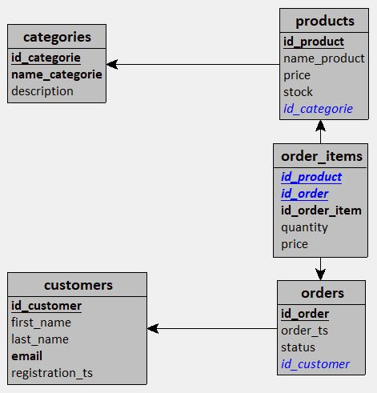

# TP SQL E-Commerce

TP du module SQL de la formation Concepteur Développeur en science des données de M2i.

Ce TP a pour objectifs :
- la conception d'un shéma relationnel d'une base de donnée,
- la création des tables dans PostgreSQL,
- l'insertion d'un jeu de données,
- l'écriture de requêtes SQL d'analyse (jointures, sous-requêtes, agrégats, logique conditionnelle) et
- la réalisation d'un rapport texte.

## Récupérer le TP

Pour récupérer le TP sur github, éxécutez la commande :

```bash
git clone https://github.com/DamienDESSAUX-M2i/TP_SQL_ECommerce.git
```

## Lancer le projet

La projet est dockerisé. Pour la création des conteneurs, placez vous dans le répertoire `TP_SQL_ECommerce/` puis exécutez les commandes :

```bash
docker compose up -d
```

Trois conteneurs `pgdb`, `pgadmin` et `app`, deux volumes `v_pgdb` et `v_pgadmin` et deux networks `db_network` et `app_network` sont créés. Un volume bind mount `TP_SQL_ECommerce/reports/` est également monté.

Pour lancer le projet, exécutez la commande : 

```bash
docker exec -it app python app.py
```

Un rapport horodaté est créé dans le dossier `TP_SQL_ECommerce/reports/`. Pour créer un nouveau rapport, relancez la commande précédente.

## Schéma relationnel

Le MCD et le MDL sont créés avec le logiciel *Looping*.




## Création des tables et insertions du jeu de données

Les requêtes SQL pour la création des tables et l'insertion du jeu de données se trouvent dans le répertoire `TP_SQL_ECommerce/sql_init/`. Ces requêtes sont exécutées à l'éxécution du docker compose.

## Requêtes SQL d'analyse

Les requêtes SQL d'analyse se trouvent dans le fichier `TP_SQL_ECommerce/sql/queries.sql`.

## Réalisation d'un rapport

Le script `TP_SQL_ECommerce/app/app.py` permet de créer un rapport texte avec le package `psycopg`.

Ce rapport contient :
- la liste des 5 clients les plus actifs,
- la liste des 5 clients les plus dépensiers,
- la liste des 3 catégories les plus rentables,
- la liste des produits ayant générés moins de 20€,
- la liste des clients n'ayant passé qu'une commande et
- le montant perdu par produit présent dans les commandes "annulées".

A l'exécution du script un rapport texte horodaté est créé dans le dossier `TP_SQL_ECommerce/reports/`.